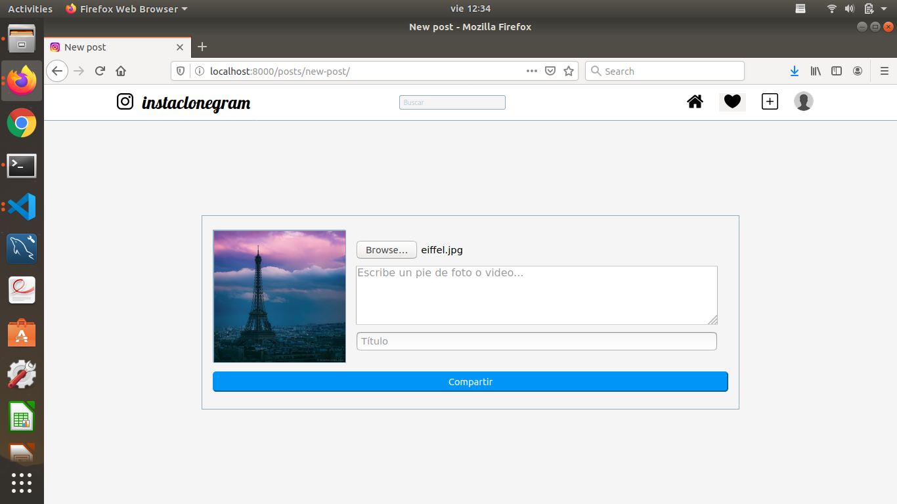

# Instaclonegram

**Instaclonegram** is a plataform based on instagram functionallity, recreates the main intagram tools for sharing photos, customize a profile,  have a contacts network and react to another photos.

#Instaclonegram users

When a user arrives to the **Instaclonegram** site there are two options, login or signup if the user don't have an account yet. 

**Login**

**Signup**

After a succesful login, the user access to  all of the utilities for his account,  this includes change his default profile and start sharing pictures, reacting and add comments.

**Home**

**Profile**

**Follow/Unfollow**
When the user access to the profile of another user the icon change between follow or unfollow if already follows the user. If the user is see his own profile this icon changes to *Editar perfil*, where the user can add more data to his profile.

# Posts

**Comments**
Comments can be published since the home page or since the post detail, users can like or dislike the comment, make a reply and interact both comments and replies in the same way. If there are replies appears a botton for display all.

**Like/Dislike**
Whe the user click on the black heart button it changes to a red one, this means the user likes content. If the user clicks again this icon returns to be black and the user like is deleted in the content. Posts, Comments and Replies has this options.

**Save post**
This function allows the user to save posts by click on the tag icon and see them in their profile by click on the option *Guardados*. The tag icon is white if the post is not saved and changes to black when is saved by the user.

# Icons
All icons in this site perform some task or display options and links. The following are icons in this site and a brief list of their functions.
**Navigation bar**

- Go to user profile 
- Search user
- Go home
- Show notifications
- Add new post

**Profile**

- Edit pofile (Only available for the owner of the account)
- Followers
- Followed
- Settings
- User posts 

**Post**

- Go to user profile (Who has publised the post)
- Follow/Unfollow other users
- Options: Delete post (Only available for the owner of the post)
- Like/Dislike
- Go to post detail
- Save/Unsave
- Comment

**Post detail**

- Go to user profile (Who has publised the post)
- Options:  Delete post (Only available for the owner of the post)
- Like/Dislike
- Comments and Replies
- Show replies

